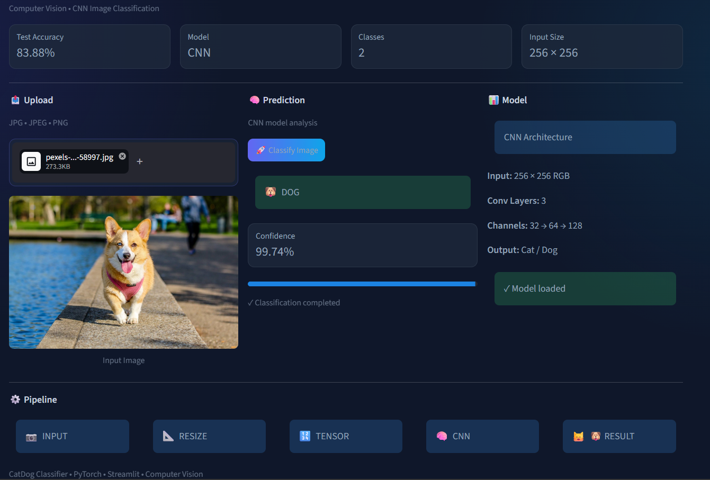

# 🐾 CatDog Classifier

A deep learning image classification project built using a Convolutional Neural Network (CNN) to classify images as **Cat** or **Dog**.

The trained PyTorch model is integrated with a Streamlit web application, allowing users to upload an image and receive a prediction with a confidence score.

## Live Demo

**Live App:** [YOUR_STREAMLIT_APP_URL](https://cat-dog-classifier-9zvr48zfemseyk2ssgosmb.streamlit.app/)

## Screenshot

Here is a screenshot of the application:

##  Project Overview

This project focuses on building an end-to-end image classification system using deep learning.

The complete workflow includes:

- Dataset preparation
- Image preprocessing
- Data augmentation
- CNN model development
- Model training
- Model evaluation
- Saving trained model weights
- Streamlit application development
- GitHub version control
- Cloud deployment

## Model Architecture

The classifier is built using PyTorch with three convolutional blocks followed by fully connected layers.

**Architecture:**

Input Image → 256×256×3 → Conv2D (32) → ReLU → MaxPooling → Conv2D (64) → ReLU → MaxPooling → Conv2D (128) → ReLU → MaxPooling → Flatten → Fully Connected (128) → ReLU → Dropout → Output → Cat / Dog

##  Model Performance

The CNN model achieved an accuracy of **83.88%** on the test dataset.

- **Test Accuracy:** 83.88%
- **Classes:** Cat and Dog
- **Input Image Size:** 256 × 256
- **Framework:** PyTorch
- **Model:** Convolutional Neural Network (CNN)

##  Prediction Pipeline

**Upload Image → Resize → Convert to Tensor → CNN Feature Extraction → Classification → Cat / Dog → Confidence Score**

## Web Application

The trained CNN model is integrated into a Streamlit web application.

Users can:

- Upload JPG, JPEG, or PNG images
- Preview the uploaded image
- Classify the image
- View the predicted class
- View prediction confidence
- Use the application from desktop or mobile devices

## Application Features

-  Cat vs Dog image classification
-  PyTorch CNN model
-  Confidence score
-  Image preview
-  Mobile-friendly interface
-  Fast inference
-  Deployed Streamlit application

##  Technologies Used

- Python
- PyTorch
- Torchvision
- Streamlit
- Pillow
- NumPy
- Jupyter Notebook
- Git
- GitHub

##  Project Structure

Cat-Dog-Classifier/
├── app.py
├── model.py
├── cat_dog_cnn.pth
├── cat_dog_classifier.ipynb
├── requirements.txt
├── .gitignore
└── README.md

##  Run Locally

### 1. Clone the Repository

git clone YOUR_GITHUB_REPOSITORY_URL

### 2. Navigate to the Project

cd Cat-Dog-Classifier

### 3. Create Virtual Environment

python -m venv .venv

### 4. Activate Virtual Environment

Windows:

.venv\Scripts\activate

### 5. Install Dependencies

pip install -r requirements.txt

### 6. Run the Application

streamlit run app.py

##  Jupyter Notebook

The complete model development and training workflow is available in:

cat_dog_classifier.ipynb

The notebook contains the training and evaluation process used to develop the CNN classifier.

##  Trained Model

The trained model weights are stored in:

cat_dog_cnn.pth

The Streamlit application loads these trained weights during inference.

##  Future Improvements

- Improve classification accuracy
- Experiment with deeper CNN architectures
- Use transfer learning with pretrained models
- Add Grad-CAM visualizations
- Add prediction history
- Improve mobile interface
- Add more image classes

## Developed by-

**Prince Yadav**

BS-MS (Mathematics & Data Science)

## ⭐ Project

If you find this project interesting, feel free to explore the repository and try the live application.

**Built with PyTorch + Streamlit + Computer Vision**